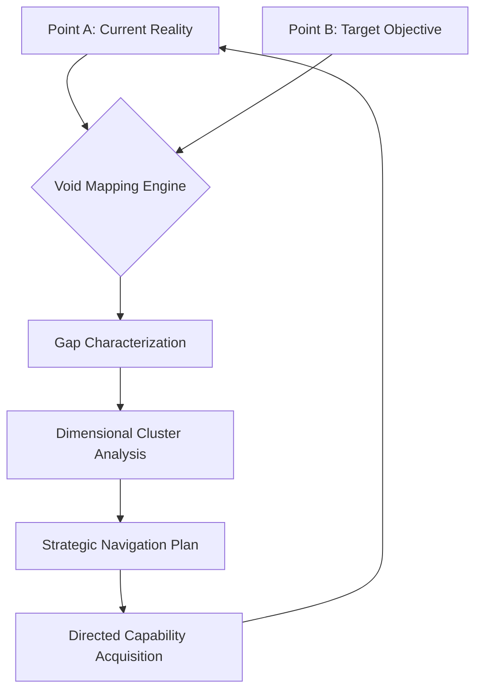

# Negative Space
### Mapping the Epistemic Void for Autonomous Navigation

[](#)
[](#)
[](#)

> "In the architecture of autonomy, the voids define the system. Negative Space is the specialized engine for mapping what is missing between the current reality and the desired computational goal."

## 🧩 The Epistemological "Why"
Traditional engineering focuses on the assembly of known components. **Negative Space Reasoning** operates on the inverse: it defines the exact shape of missing dependencies, information gaps, and constraint barriers. By treating the "void" as a first-class object, we transform systemic uncertainty into a precisely mapped territory, allowing agentic systems to navigate complexity through exclusion and targeted inquiry.

## 🧭 The Logic Flow (The Void Engine)


## 🛰️ The "Now": Mapping Architectural Voids
The following snippet demonstrates use of the `VoidAgent` to perform a rigorous assessment of the gap between a local environment and a production-ready Kubernetes deployment.

```python
from negative_space.core.agent import VoidAgent
from negative_space.core.core import GapCriticality

# Initialize the observer
agent = VoidAgent(name="EpistemicMapper", rigor=0.95)

# Define the reality gap
reality_a = {"infra": "local", "security": "basic"}
objective_b = {"infra": "k8s_prod", "security": "zero_trust"}

# Generate the Void Report
report = await agent.map_voids(reality_a, objective_b)

critical_voids = [g for g in report['critical_findings'] if g['criticality'] == "BLOCKING"]
print(f"Mapped {len(critical_voids)} blocking voids in the production path.")
```

## 📊 Strategic Metrics
| Metric | Purpose | Agent Insight |
| :--- | :--- | :--- |
| **Void Density** | Volume of missing logic | "The path to B requires 80% new logic acquisition." |
| **Gap Criticality** | Impact of the void | "This information gap blocks all downstream causal links." |
| **Navigability** | Ease of traversing gaps | "The void is highly connected; addressing Gap X resolves Y." |
| **Fillability** | Feasibility of closure | "This constraint is emergent and may require B-redefinition." |

---
docs: formalize high-fidelity documentation and epistemological grounding
*Developed for WADELABS AI Safety Research 2026*
